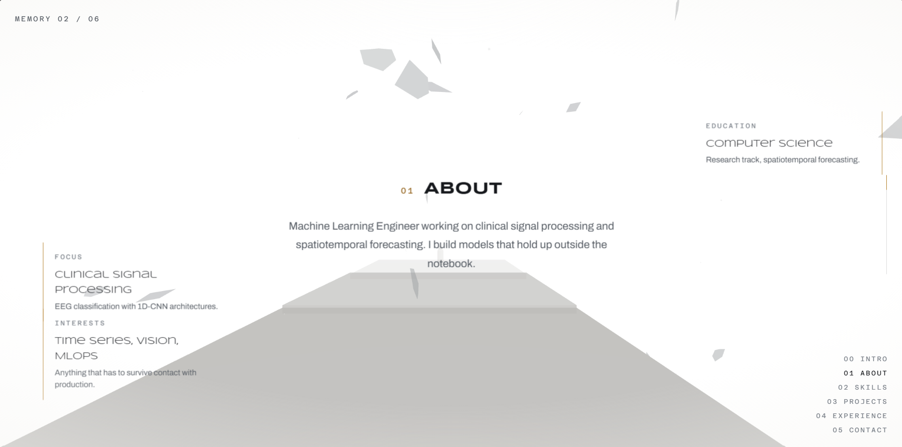

# web-porto

A 3D portfolio built as a scroll-driven memory corridor. The page is a walk
down a WebGL road, and each section of the resume docks into the scene with
depth, fog and drifting glass shards.



## How it reads

- **Corridor mode.** On a desktop browser with WebGL, scrolling drives a
  camera down a corridor of shadowed road. Hero, about, skills, projects,
  experience and contact live at fixed points along the walk; each section
  drifts in, lights up, fades, and is culled once it passes the camera.
- **Document mode.** With reduced motion, on a narrow viewport, or without
  WebGL, the same content is an ordinary scrolling page. No corridor is
  rendered and the sections simply stack.

## Features

- Skills constellation: markers anchored along the walk that light up as the
  camera approaches, scaling with a quality tier.
- Project carousel: three cards, each getting a centered in-focus moment
  when its scene arrives.
- Memory shards and dust: irregular semi-transparent glass pieces and light
  motes wrapped around the camera so the corridor always has something
  ahead.
- POV steering: the camera leans toward the cursor with a damped, frame-rate
  independent lag, ignored entirely under reduced motion.
- Shared fog: section text is rendered in a DOM depth layer that fades in
  step with the 3D world, so copy and the corridor meet at the same haze.

## Stack

React 19, TypeScript, Vite, Three.js with React Three Fiber, Lenis.

## Getting started

```
npm install
npm run dev
```

## Checking and building

```
npm run check   # tsc --noEmit plus per-feature smoke checks
npm run build
```

`npm run check` runs TypeScript and a set of small assertion scripts under
`scripts/check-*.ts` that guard the corridor invariants: scroll-to-scene
mapping, platform and road placement, constellation visibility windows,
carousel focus order, and quality tiers.

## Structure

```
src/
  components/experience/   Three.js world: corridor, walker, camera, shards
  components/scenes/       One scene per section, mapped along the walk
  components/ui/           DOM depth layer, project cards, HUD, intro
  data/                    Profile, projects, experience and skills content
  lib/                     Scroll, depth, carousel, constellation, quality
scripts/                   Smoke checks run by npm run check
```